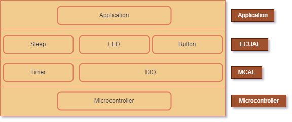
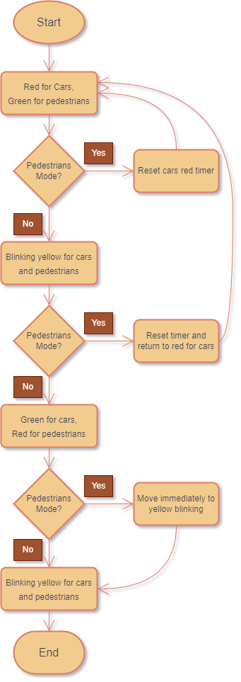
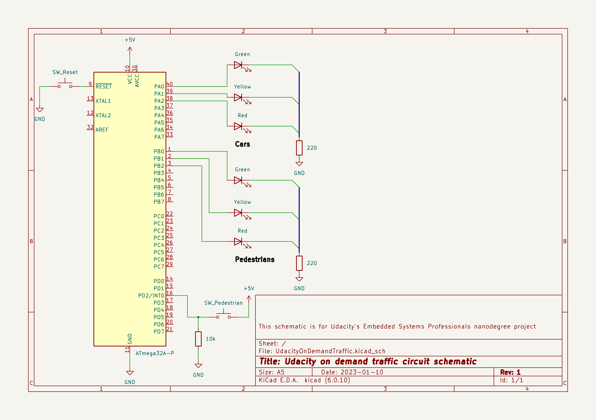
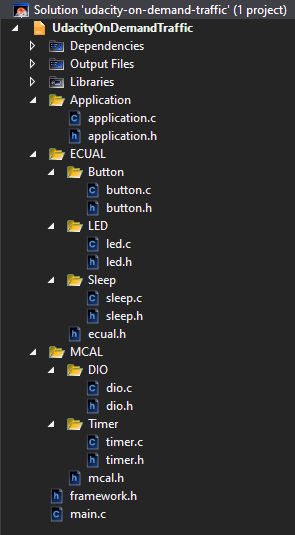

udacity-on-demand-traffic
=========================

This repository contains the source tree for a project required by Udacity's Embedded Systems Professional nanodegree. This source tree shall only be used according to the terms outlined in [LICENSE](./LICENSE).

The source is built using `Microchip Studio 7 (Version: 7.0.2594 - )`.

Rubric Videos
-------------

- [🎥 System Design (6:35)](./docs/vids/1_vid_system_design.mp4)
- [🎥 Development Environment (4:39)](./docs/vids/2_vid_dev_env.mp4)
- [🎥 Application Implementation (19:11, Drivers testing starts @ 14:25)](./docs/vids/3_vid_implement_app.mp4)
- [🎥 Application User Stories (4:28)](./docs/vids/4_vid_test_user_cases.mp4)

System Description
------------------

This system is a traffic control system that prioritizes pedestrians. At designated road crossings with traffic lights, pedestrians can request green light for crossing on-demand. Our system, in normal mode, moves car traffic lights from rad to yellow then green and vice versa, with the opposite happening for the pedestrians lights. Each stage lasts for five seconds, noting in yellow stage the light blinks. When the pedestrian presses a request button for crossing, the system enters pedestrian mode. In pedestrian mode, if the car lights were red or yellow moving to red, the system resets the five seconds interval. If the car lights were yellow moving to green, the system resets the interval and then moves to red for cars. If the car lights were green, the system moves immediately to yellow with five seconds blink then to red. The system returns to normal operation afterwards.

System Design
-------------

The system uses `ATmega32` microcontroller as the embedded brain. We have three major layers on-top of the microcontroller: the microcontroller abstraction layer (MCAL), the electronic unit abstraction layer (ECUAL), and the application. Our MCAL has two drivers: the digital input/output driver (DIO), and the timer diver. The ECUAL has three higher-level drivers: the LED driver, the sleep driver, and the button driver. Our system embraces SOLID principles preventing higher levels from direct communication with any lower level other than the one directly below.

System Flowchart
----------------

Demo Circuit
------------

Folder Structure
----------------

License
-------

Refer to [LICENSE](./LICENSE)
